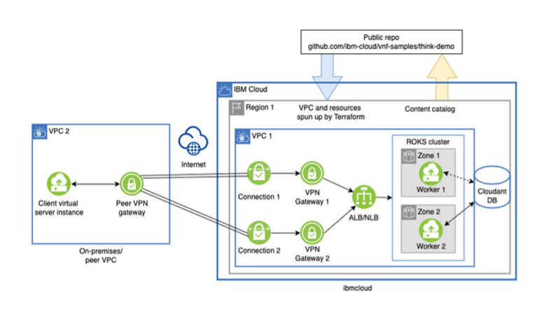

# ansible-app-deploy-roks-local

Git clone the repository and execute the ansible playbook. Under ansible roles directory, you will find that web and loadbalancer services are provided by user along with VPC subnet and region, Cloudant Database URL and API Key. Login to cloud, download the Kubernetes cluster config in your local system, and execute the ansible playbook to deploy application, and create ALB service. 



To run locally in your mac to configure a webapp in a ROKS cluster

Before executing the ansible playbook:   

1. Add account apikey in main.tf file   
2. Add Cloudant apikey in roles/web/tasks/main.yml  
3. Add RIAS API Key in think_demo_script.sh

```
export RIAS_API_KEY=""
```


### Steps:  

1. Login to IBM Cloud.   

2. Download Cluster :   

```
malark@Malars-MacBook-Pro ansible-app-deploy-roks-local % ibmcloud ks cluster config -c cluster-think-demo --admin  
OK
The configuration for cluster-think-demo was downloaded successfully.

Added context for cluster-think-demo to the current kubeconfig file.
You can now execute 'kubectl' commands against your cluster. For example, run 'kubectl get nodes'.
If you are accessing the cluster for the first time, 'kubectl' commands might fail for a few seconds while RBAC synchronizes.

```

3. Run ansible-playbook:  

```
malark@Malars-MacBook-Pro ansible-app-deploy-roks-local % ansible-playbook site.yml           
[WARNING]: No inventory was parsed, only implicit localhost is available
[WARNING]: provided hosts list is empty, only localhost is available. Note that the implicit localhost does not match 'all'

PLAY [localhost] *******************************************************************************************************************************************************************************************

TASK [Gathering Facts] *************************************************************************************************************************************************************************************
ok: [localhost]

PLAY [apply common configuration to all nodes] *************************************************************************************************************************************************************

TASK [Gathering Facts] *************************************************************************************************************************************************************************************
ok: [localhost]

TASK [web : Create Web Application] ************************************************************************************************************************************************************************
changed: [localhost]

TASK [loadbalancer : Create alb web service] ***************************************************************************************************************************************************************
changed: [localhost]

PLAY RECAP *************************************************************************************************************************************************************************************************
localhost                  : ok=4    changed=2    unreachable=0    failed=0    skipped=0    rescued=0    ignored=0   
```

4. After the ansible playbook is executed, verify that the containers and service are created.

``` 
List all pods created:   

malark@Malars-MacBook-Pro ansible-app-deploy-roks-local % kubectl get pods          
NAME                                   READY   STATUS    RESTARTS   AGE
app-lb-deployment-697ccdd965-5qkpx     1/1     Running   0          91s
app-lb-deployment-697ccdd965-9t5qp     1/1     Running   0          91s
app-lb-deployment-697ccdd965-tgjmf     1/1     Running   0          91s

List all services: 

malark@Malars-MacBook-Pro ansible-app-deploy-roks-local % kubectl get svc
NAME                           TYPE           CLUSTER-IP       EXTERNAL-IP                            PORT(S)          AGE
app-lb-service                 LoadBalancer   172.21.244.16    4612b855-us-south.lb.appdomain.cloud   8000:30990/TCP   42m
kubernetes                     ClusterIP      172.21.0.1       <none>                                 443/TCP          49d
…

```
5. Once the ALB is created, you can create the VPN gateways by running the terraform script as shown below. The terraform script needs the subnets of the client VSI in VPC2 and the load balancer service subnets in VPC. Based on the subnets, it creates the VPN gateway connection.

```
malark@Malars-MacBook-Pro ansible-app-deploy-roks-local % terraform apply --var-file="terraform.tfvars" -auto-approve
```

So far, we have deployed the 3 tier application. ALB is created. VPN gateways and its connections are provisioned between 2 VPCs. In order for the application to be highly available, the VPN gateway connection needs to be created in all the subnets where the ALB subnets exists. Since the ALB is an Active/Active Load Balancer, the Private IP of the load balancer keeps changing. Hence multiple VPN Gateways and connections pointing to multiple Private IPs of Load balancer needs to be created for the Client VSI in VPC2 to communicate with application in VPC1. 

6. Login to a VSI in VPC2 and try to access th ALB Service in VPC1.   

```
malark@Malars-MacBook-Pro ansible-app-deploy-roks-local % ssh root@52.xxx.xxx.xxx          

root@demo-think-peer-vsi:~# curl http://4612b855-us-south.lb.appdomain.cloud:8000
<!DOCTYPE html>
<html lang="en">
<head>
    <meta charset="UTF-8">
    <title>Show all employees</title>
</head>
<body>
<h3>List of all employees</h3>

<table border="1">
    <tr>
        <th align="center">Employee Id</th>
		<th align="center">Name</th>
    </tr>
    
    
    
    …
    
</table> 
```

The ansible and terraform scripts can be combined in a single shell script. If there are any application logic to fetch the subnets of ALB, this can be automated by using a python program. You can find the shell script for one-click deployment in the github repository. 
