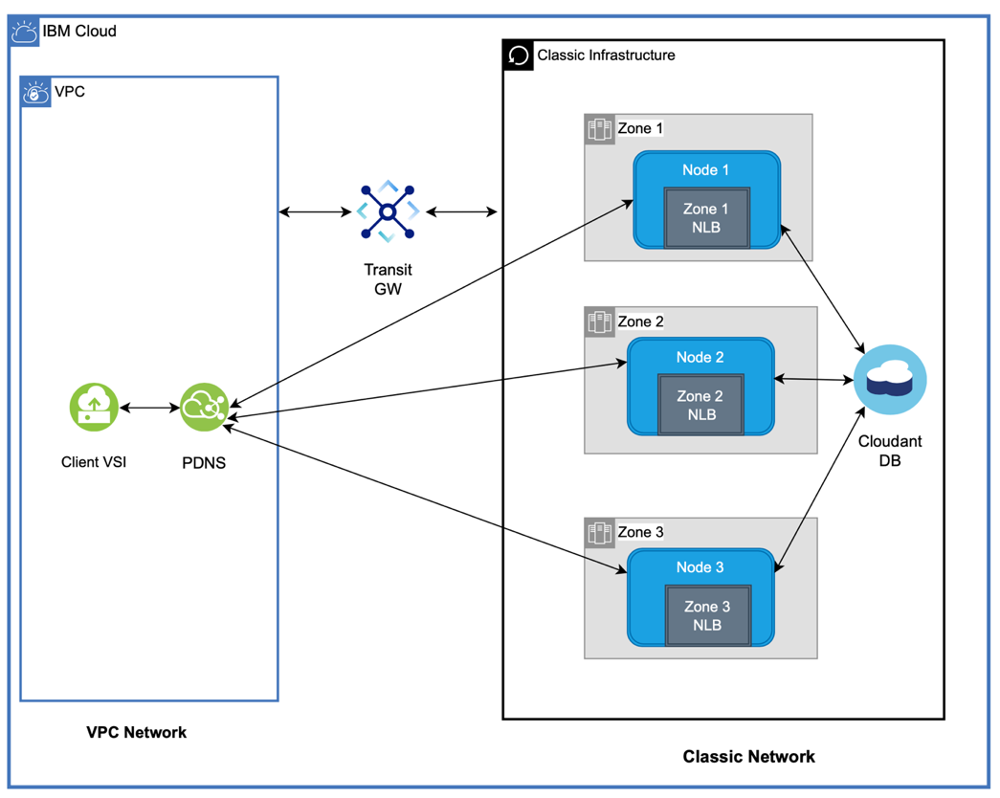

# Automating web application deployment with NLB on IBM Cloud Kubernetes Service

# ansible-app-iks-tg-dns



Git clone the repository and execute the ansible playbook. Under ansible roles directory, you will find that web and loadbalancer services are provided by user along with VLAN and zone, region, Cloudant Database URL and API Key. Login to cloud, download the Kubernetes cluster config in your local system, and execute the ansible playbook to deploy application, and create NLB service. 


To run locally in your mac to configure a webapp in a IKS cluster


### Steps:  

1. Login to IBM Cloud.   

2. Download Cluster :   

```
malark@Malars-MacBook-Pro ansible-app-iks-tg-dns % ibmcloud ks cluster config -c cluster-think-demo --admin  
OK
The configuration for cluster-think-demo was downloaded successfully.

Added context for cluster-think-demo to the current kubeconfig file.
You can now execute 'kubectl' commands against your cluster. For example, run 'kubectl get nodes'.
If you are accessing the cluster for the first time, 'kubectl' commands might fail for a few seconds while RBAC synchronizes.

```

3. Run ansible-playbook:  

```
malark@Malars-MacBook-Pro ansible-app-iks-tg-dns % ansible-playbook site.yml                          
[WARNING]: No inventory was parsed, only implicit localhost is available
[WARNING]: provided hosts list is empty, only localhost is available. Note that the implicit localhost does not match 'all'

PLAY [localhost] *******************************************************************************************************************************************************************************************

TASK [Gathering Facts] *************************************************************************************************************************************************************************************
ok: [localhost]

PLAY [apply common configuration to all nodes] *************************************************************************************************************************************************************

TASK [Gathering Facts] *************************************************************************************************************************************************************************************
ok: [localhost]

TASK [web : Create Web Application] ************************************************************************************************************************************************************************
ok: [localhost]

TASK [loadbalancer : Create nlb dal10 web service] *********************************************************************************************************************************************************
changed: [localhost]

TASK [loadbalancer : Create nlb dal12 web service] *********************************************************************************************************************************************************
changed: [localhost]

TASK [loadbalancer : Create nlb dal13 web service] *********************************************************************************************************************************************************
changed: [localhost]

PLAY RECAP *************************************************************************************************************************************************************************************************
localhost                  : ok=6    changed=3    unreachable=0    failed=0    skipped=0    rescued=0    ignored=0   
```

4. Check application:

```
malark@Malars-MacBook-Pro ansible-app-iks-tg-dns % kubectl get deployments                           
NAME                READY   UP-TO-DATE   AVAILABLE   AGE
app-lb-deployment   3/3     3            3           51s
malark@Malars-MacBook-Pro ansible-app-iks-tg-dns % kubectl get pods                                  
NAME                                 READY   STATUS    RESTARTS   AGE
app-lb-deployment-7456497dc5-mgqbd   1/1     Running   0          60s
app-lb-deployment-7456497dc5-ttzsg   1/1     Running   0          60s
app-lb-deployment-7456497dc5-vqs8c   1/1     Running   0          60s
```

5. Check services:
```
malark@Malars-MacBook-Pro ansible-app-iks-tg-dns % kubectl get services       
NAME                           TYPE           CLUSTER-IP       EXTERNAL-IP      PORT(S)          AGE
flasknode-vpc-nlb-us-south-1   LoadBalancer   172.21.119.57    10.177.187.146   8000:32575/TCP   22s
flasknode-vpc-nlb-us-south-2   LoadBalancer   172.21.105.33    10.74.5.178      8000:30078/TCP   19s
flasknode-vpc-nlb-us-south-3   LoadBalancer   172.21.153.108   10.187.250.42    8000:31353/TCP   17s
kubernetes                     ClusterIP      172.21.0.1       <none>           443/TCP          23d
```

6. Login to a classic VSI and invoke web application using NLB:

```
malark@Malars-MacBook-Pro ansible-app-iks-tg-dns % ssh root@169.xxxx
Welcome to Ubuntu 20.04.4 LTS (GNU/Linux 5.4.0-113-generic x86_64)
....
root@dal10classicvs:~# curl http://10.177.187.146:8000
<!DOCTYPE html>
<html lang="en">
<head>
    <meta charset="UTF-8">
    <title>Show all employees</title>
</head>
<body>
<h3>List of all employees</h3>

<table border="1">
    <tr>
        <th align="center">Employee Id</th>
		<th align="center">Name</th>
    </tr>
    
    <tr>
        <td align="center">444</td>
        <td align="center">Sita</td>
	</tr>
    
    <tr>
        <td align="center">234</td>
        <td align="center">IBM</td>
	</tr>
    
    <tr>
        <td align="center">123</td>
        <td align="center">Network</td>
	</tr>
    
</table
```
