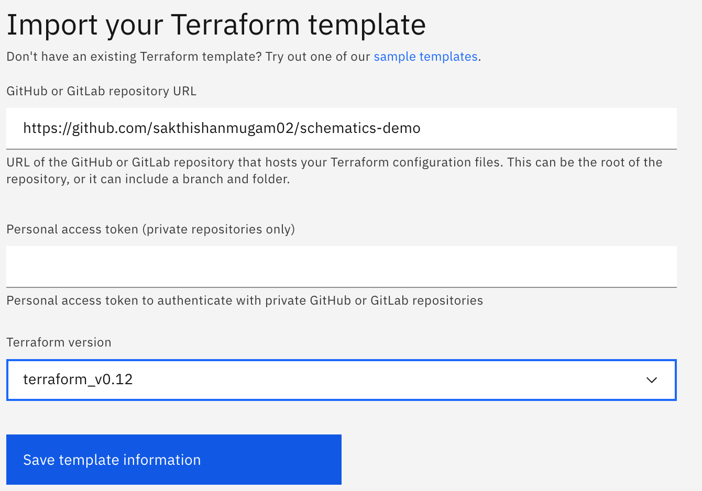
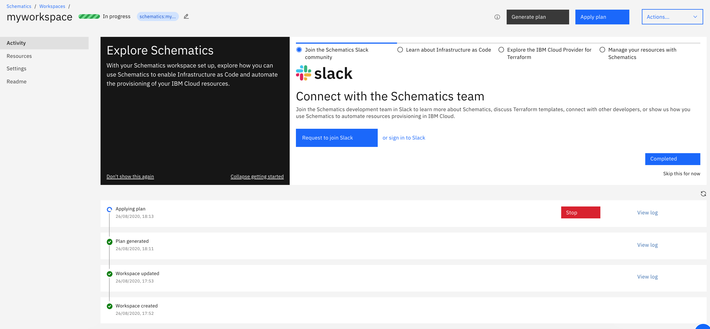
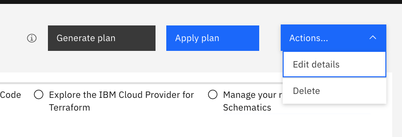
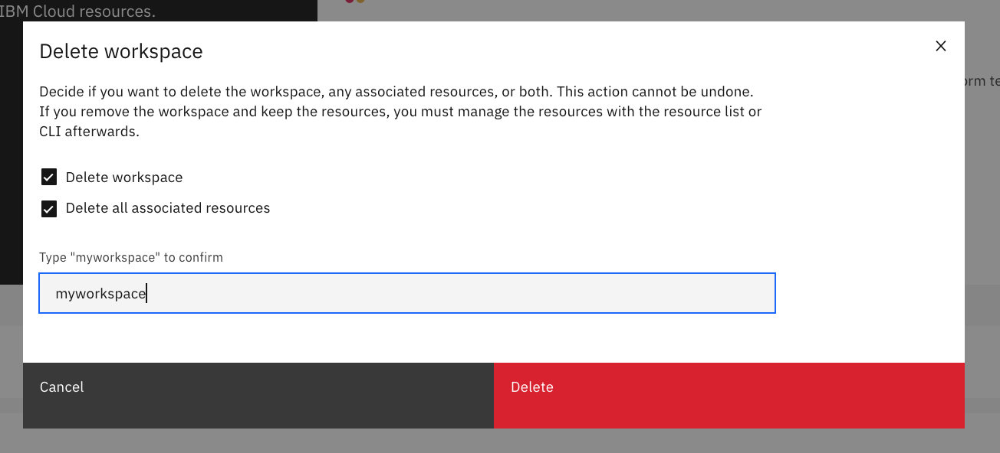

# Example to illustrate how a nodejs application can access Mongo DB using Private DNS

The intent of this article is to walk you through the process that are involved in setting up a simple client and server virtual server instance (VSI) in the IBM Cloud VPC with Private DNS (P-DNS) using Schematics (Terraform as a Service from IBM Cloud).   

The example below illustrates how a nodejs application can access Mongo DB using Private DNS in a VPC in IBM Cloud.


The team members who worked on this example:  

Sakthi Saravanan Shanmugam (sakshan1@in.ibm.com), IBM Cloud Network  
Malarvizhi Kandasamy (k.malarvizhi@in.ibm.com), IBM Cloud Network     


> What you'll learn

The reader will get to know the steps to the provision below IBM Cloud services using Terraform:

- Virtual Private Cloud
- Subnet
- Two VSI's (one would act as a MongoDB server, and other as a NodeJS based client)
- Required security group rules
- Private DNS instance with required DNS records

> Prerequisite:

- IBM Cloud account

> Setup and Requirements

While running through this exercise, the user would end up creating a Terraform codebase that would help us provisioning required IBM Cloud services that are intended. The later part of this exercise would explain the process relates to executing the Terraform code using Schematics. Also, we have provided the steps to install Mongo db in server VSI and nodejs in client VSI. We will show you how a nodejs application can connect to mongodb using private domain name service.  

### Assumption:

You should have the GitHub repo created that would contain the below-mentioned code snippets. 

** Create a file named "main.tf" and start adding following contents into that **

#### Initialize the terraform provider plugin:

Terraform is the de facto industry automation tool for provisioning and managing the resources in the Cloud environment. It supports multiple cloud providers, hence explicit plugin initialization is required to point to specific cloud infrastructure. For e.g. IBM Cloud.

*Add the below lines into the `main.tf` file:*

```
provider "ibm" {
  generation = 2
  region     = "us-south"
}
```
#### Provision a VPC:

A VPC is a public cloud offering that lets an enterprise establish its own private cloud-like computing environment on shared public cloud infrastructure. A VPC gives an enterprise the ability to define and control a virtual network that is logically isolated from all other public cloud tenants, creating a private, secure place on the public cloud.

*To provision a VPC, add below code snippets into the `main.tf` file.*

***Note:*** Resource Group is assumed to be `Default` in this exercise if needed change it as per the requirement.

```
data "ibm_resource_group" "rg" {
  name = "Default"
}

resource "ibm_is_vpc" "test_schematics_demo_vpc" {
  depends_on     = [data.ibm_resource_group.rg]
  name           = "test-schematics-demo-vpc"
  resource_group = data.ibm_resource_group.rg.id
}
```
#### Provision a Subnet: 

A VPC is divided into subnets, using a range of private IP addresses. Subnets are contained within a single zone and cannot span multiple zones, which helps improve security, reduce latency, and enable high availability.

*To provision a Subnet, add below code snippets into the `main.tf` file.*

```
resource "ibm_is_subnet" "test_schematics_demo_subnet" {
  name            = "test-schematics-demo-subnet"
  vpc             = ibm_is_vpc.test_schematics_demo_vpc.id
  zone            = "us-south-1"
  ipv4_cidr_block = "10.240.0.0/24"
}
```
#### Provision Security Group and Rules:

Security Group is a set of IP filter rules that define how to handle incoming (ingress) and outgoing (egress) traffic to both the public and private interfaces of a virtual server instance. The rules that you add to a security group are known as security group rules.

***Note:*** By default, there will be no traffic allowed in and out of VSI. Explicitly add rules based on the requirements. In this exercise, we would allow all traffic in & out.

*To add a Security Group, add below code snippets into the `main.tf` file.*

```
resource "ibm_is_security_group" "test_schematics_demo_sg" {
  name           = "test-schematics-demo-sg"
  vpc            = ibm_is_vpc.test_schematics_demo_vpc.id
  resource_group = data.ibm_resource_group.rg.id
}
```

*To add a Security Rules into the group that got created above, add below code snippets into the `main.tf` file.*

```
resource "ibm_is_security_group_rule" "test_schematics_demo_sg_rule_all_in" {
  depends_on = [ibm_is_security_group_rule.test_schematics_demo_sg_rule_ssh]
  group      = ibm_is_security_group.test_schematics_demo_sg.id
  direction  = "inbound"
  remote     = "0.0.0.0/0"
}

resource "ibm_is_security_group_rule" "test_schematics_demo_sg_rule_all_out" {
  depends_on = [ibm_is_security_group_rule.test_schematics_demo_sg_rule_all_in]
  group      = ibm_is_security_group.test_schematics_demo_sg.id
  direction  = "outbound"
  remote     = "0.0.0.0/0"
}
```

#### Provision Virtual Server Instances:

With Virtual Servers for VPC, you can create an instance that consists of your virtual compute resources and resulting capacity within an IBM Cloud VPC. When you provision an instance, you select an instance profile that matches the amount of memory and compute power that you need for the application or software that you plan to run on the instance.

***Note:*** In this exercise, we would be spinning up two VSIs that are based on Ubuntu 18.04, this image is already available in the IBM Cloud, so we just need to fetch the image information to input to the instance block. 

*To fetch Ubuntu 18.04 image information, add below code snippets into the `main.tf` file.*

```
data "ibm_is_image" "test_schematics_demo_image" {
  name = "ibm-ubuntu-18-04-1-minimal-amd64-2"
}
```
***Note:*** Before spinning up the VSI, we would need to add SSH keys into the IBM Cloud to access the VSI instance. The assumption here is that already this process is taken care of. To fetch the ssh key that needs to be added to the VSI, add the following piece of code into the `main.tf`file.

```
data "ibm_is_ssh_key" "test_schematics_demo_ssh_key" {
  name = "user-ssh"
}
```
###### Spin up the server VSI using the below code, add it into the `main.tf` file.

```
resource "ibm_is_instance" "test_schematics_demo_vsi_server" {
  depends_on = [ibm_is_security_group_rule.test_schematics_demo_sg_rule_all_out]
  name           = "test-schematics-demo-vsi-server"
  image          = data.ibm_is_image.test_schematics_demo_image.id
  profile        = "bx2-16x64"
  resource_group = data.ibm_resource_group.rg.id

  primary_network_interface {
    subnet          = ibm_is_subnet.test_schematics_demo_subnet.id
    security_groups = [ibm_is_security_group.test_schematics_demo_sg.id]
  }

  vpc  = ibm_is_vpc.test_schematics_demo_vpc.id
  zone = "us-south-1"
  keys = ["${data.ibm_is_ssh_key.test_schematics_demo_ssh_key.id}"]

  timeouts {
    create = "10m"
    delete = "10m"
  }
}
```

###### Spin up the client VSI using the below code, add it into the `main.tf` file.

```
resource "ibm_is_instance" "test_schematics_demo_vsi_client" {
  depends_on = [ibm_is_security_group_rule.test_schematics_demo_sg_rule_all_out]
  name           = "test-schematics-demo-vsi-client"
  image          = data.ibm_is_image.test_schematics_demo_image.id
  profile        = "bx2-16x64"
  resource_group = data.ibm_resource_group.rg.id

  primary_network_interface {
    subnet          = ibm_is_subnet.test_schematics_demo_subnet.id
    security_groups = [ibm_is_security_group.test_schematics_demo_sg.id]
  }

  vpc  = ibm_is_vpc.test_schematics_demo_vpc.id
  zone = "us-south-1"
  keys = ["${data.ibm_is_ssh_key.test_schematics_demo_ssh_key.id}"]

  timeouts {
    create = "10m"
    delete = "10m"
  }
}

```
#### Provision a Private DNS Instance:

Computers on a network can find one another by IP addresses. To make it easier to work within a computer network, people can use a Domain Name System (DNS) to associate human-friendly domain names with IP addresses, similar to a phonebook. A DNS can also associate other information beyond just computer network addresses to domain names. IBM Cloud™ DNS Services provides private DNS to Virtual Private Cloud (VPC) users. Private DNS zones are resolvable only on IBM Cloud, and only from explicitly permitted networks (VPC) in an account.

*To provision a P-DNS instance, add below code snippets into the `main.tf` file.*

```
resource "ibm_resource_instance" "test_schematics_demo_pdns" {
  depends_on        = [ibm_is_vpc.test_schematics_demo_vpc]
  name              = "test-schematics-demo-pdns"
  resource_group_id = data.ibm_resource_group.rg.id
  location          = "global"
  service           = "dns-svcs"
  plan              = "standard-dns"
}
```

*To create a P-DNS zone and define domain to the zone, add below code snippets into the `main.tf` file.*

```
resource "ibm_dns_zone" "test_schematics_demo_pdns_zone" {
  depends_on  = [ibm_resource_instance.test_schematics_demo_pdns]
  name        = "test.com"
  instance_id = ibm_resource_instance.test_schematics_demo_pdns.guid
  description = "testdescription"
  label       = "testlabel"
}
```

*To associate permitted network to the Private DNS zone, add below code snippets into the `main.tf` file.*
```
resource "ibm_dns_permitted_network" "test_schematics_demo_pdns_permitted_network" {
  depends_on  = [ibm_dns_zone.test_schematics_demo_pdns_zone]
  instance_id = ibm_resource_instance.test_schematics_demo_pdns.guid
  zone_id     = ibm_dns_zone.test_schematics_demo_pdns_zone.zone_id
  vpc_crn     = ibm_is_vpc.test_schematics_demo_vpc.resource_crn
}
```

###### For this exercise, we would be creating a simple 'A' record that would point to server VSI, so that client can access the server using this DNS address.

*Add below code snippets into the `main.tf` file.*

```
resource "ibm_dns_resource_record" "test_schematics_demo_pdns_record_a" {
  depends_on  = [ibm_dns_permitted_network.test_schematics_demo_pdns_permitted_network, ibm_is_instance.test_schematics_demo_vsi_server]
  instance_id = ibm_resource_instance.test_schematics_demo_pdns.guid
  zone_id     = ibm_dns_zone.test_schematics_demo_pdns_zone.zone_id
  type        = "A"
  name        = "testA"
  rdata       = ibm_is_instance.test_schematics_demo_vsi_server.primary_network_interface[0].primary_ipv4_address
  ttl         = 900
}
```

#### Reserve and Associate Floating IP to the Client VSI to access from your machine:

*Add below code snippets into the `main.tf` file.*

```
resource "ibm_is_floating_ip" "test_schematics_demo_fip" {
  name   = "test-schematics-demo-fip"
  target = ibm_is_instance.test_schematics_demo_vsi_client.primary_network_interface.0.id
}
```

###### Output the required values, in case anything needed, Terraform would print those at the end after successful execution.

```
output "server_private_ip" {
  value       = ibm_is_instance.test_schematics_demo_vsi_server.primary_network_interface[0].primary_ipv4_address
  description = "The private IP of the server."
}

output "client_private_ip" {
  value       = ibm_is_instance.test_schematics_demo_vsi_client.primary_network_interface[0].primary_ipv4_address
  description = "The private IP of the client."
}

output "client_floating_ip" {
  value       = ibm_is_floating_ip.test_schematics_demo_fip.address
  description = "The floating IP of the client."
}
```
***Now, the code would look something like the below link.***

https://github.com/IBM-Cloud/vnf-samples/tree/master/pdns-mongo-nodejs/main.tf

> Schematics Overview:

IBM Cloud Schematics delivers Terraform-as-a-Service so that you can use a high-level scripting language to model the resources that you want in your IBM Cloud environment, and enable Infrastructure as Code (IaC). The below picture explains the workflow of the Terraform and Schematics. 


***To execute the Terraform code*** that we have written so far, we can leverage the Schematics tool from IBM. That lessens the task of managing Terraform versions, state files, user management, etc,. To do that login to the IBM Cloud and select Schematics from the left pane.


***Create a Schematics workspace*** by selecting the Location, and by clicking the Create workspace button.

This workspace is an isolated environment where state files, in fact, complete execution lifecycle of Terraform is separated from other workspaces. 


***Fill the name and resource group*** for the Schematics workspace that is going to be created, then click Create.


***Import the terraform template*** (link to the repo in which we have pushed the code) and select the terraform version required.



On successful import, the page will get redirected to the workspace settings page, in this exercise, there are no input variables declared, hence it will say "Workspace Variables: There are no variables defined for the workspace."


Now we are ready with workspace in which we can start executing Terraform code. To do that, we can use the `Generate plan` and `Apply plan`. (that are equivalent to `terraform plan` and the `terraform apply` command.

***Note:*** `terraform plan` command will not create any resources in the cloud infrastructure. It is just the dry run to get the report on what changes the `apply` command will make. This report would be generated with the help of comparing state file information with current infrastructure on the cloud.

We can view the status of the `plan` or the `apply` operation in the `Activity` page, if needed we can choose the see the detailed logs from the Terraform console for each operation by clicking `View log` link against the operation status.

  


### Updating the DNS resolver for your VSI

Once the resources are provisioned, you need to follow this link to update the dns resolver on your server and client VSI: https://cloud.ibm.com/docs/dns-svcs?topic=dns-svcs-updating-dns-resolver  

The steps has to be followed in all the VSI where you want to access the DNS name : **testa.testpdns.com**.

Otherwise, you will get the below error:   

**curl: (6) Could not resolve host: testa.testpdns.com.**    

Since, we have used ubuntu 18_04 image for server and client VSI, we need to follow the steps listed under the section: **VPC with generation 2 compute instances** corresponding to your operation system. I followed the steps for **Configuring Ubuntu Linux 18.04 LTS Bionic Beaver**  

1. Ensure your version of netplan is 0.95 or later:  

> dpkg -l |grep netplan  
ii  netplan.io                       0.40.1~18.04.4                      amd64        YAML network configuration abstraction for various backends


If your netplan version is earlier than 0.95, upgrade netplan:  

> apt-get update
> apt-get upgrade

**FYI: Ubuntu 18.04 has a known issue, netplan 0.95 or later is not yet available in Ubuntu 18.04, please see link https://askubuntu.com/questions/1120998/error-in-network-definition-unknown-key-dhcp4-overrides **  

2. Create the file /etc/netplan/99-custom-dns.yaml with the following content:  
```
network:   
    version: 2   
    ethernets:  
        ens3:  
            nameservers:  
                addresses: [ "161.26.0.7", "161.26.0.8" ]   
```

> **NOTE:**  dhcp4-overrides requires netplan 0.95 or later, which is not yet available in Ubuntu 18.04. dhcp4-overrides will not work in ubuntu 18.04, hence removed the line. 
            
 3. Apply the changes to netplan: 

> netplan apply               

4. Open the /etc/dhcp/dhclient.conf file and add the line:  
      
> supersede domain-name-servers 161.26.0.7, 161.26.0.8;   

5. Run the following command to release the current lease and stop the running DHCP client, then restart the DHCP client. Doing this ensures the statically configured DNS servers take precedence globally.     

    > dhclient -v -r; dhclient -v  
  
If you are still unable to resolve with the new configuration, flush all DNS resource record caches the systemd service maintains locally, and try again.         

> systemd-resolve --flush-caches   

The above steps needs to be performed in both Server and Client VSI. Restart Server and Client VSI by Stopping and Starting VSI in cloud.ibm.com.    

Now, lets test whether the private dns configuration is working properly in VSI server and client.    

1. SSH to Server VSI :

ssh root@<floating IP> 
      
2. ping testa.testpdns.com : You should be able to ping using pdns name. You should get response from private ip address of VSI Server.   

```
root@schematics-demo-vsi-server-1:~# ping testa.testpdns.com
PING testa.testpdns.com (10.240.0.9) 56(84) bytes of data.
64 bytes from schematics-demo-vsi-server-1 (10.240.0.9): icmp_seq=1 ttl=64 time=0.022 ms
64 bytes from schematics-demo-vsi-server-1 (10.240.0.9): icmp_seq=2 ttl=64 time=0.115 ms
64 bytes from schematics-demo-vsi-server-1 (10.240.0.9): icmp_seq=3 ttl=64 time=0.039 ms
64 bytes from schematics-demo-vsi-server-1 (10.240.0.9): icmp_seq=4 ttl=64 time=0.039 ms
64 bytes from schematics-demo-vsi-server-1 (10.240.0.9): icmp_seq=5 ttl=64 time=0.039 ms
64 bytes from schematics-demo-vsi-server-1 (10.240.0.9): icmp_seq=6 ttl=64 time=0.040 ms

^C      
```
Similarly, try the pdns name in Client VSI:   

1. SSH to Client VSI :  
  
ssh root@<floating IP>   
      
2. ping testa.testpdns.com : You should be able to ping using pdns name. You should get response from private ip address of VSI Server.     
```
root@schematics-demo-vsi-client-1:~# ping testa.testpdns.com
PING testa.testpdns.com (10.240.0.9) 56(84) bytes of data.
64 bytes from 10.240.0.9 (10.240.0.9): icmp_seq=1 ttl=64 time=0.610 ms
64 bytes from 10.240.0.9 (10.240.0.9): icmp_seq=2 ttl=64 time=0.462 ms
64 bytes from 10.240.0.9 (10.240.0.9): icmp_seq=3 ttl=64 time=0.379 ms
64 bytes from 10.240.0.9 (10.240.0.9): icmp_seq=4 ttl=64 time=0.414 ms
64 bytes from 10.240.0.9 (10.240.0.9): icmp_seq=5 ttl=64 time=0.388 ms
^C
  
```

### Install Mongodb in Server VSI

Now, lets install Mongodb in Server VSI. 

1. SSH to Server VSI :  
  
ssh root@<floating IP>  

2. Install Mongo db by following the steps below:  

** Mongo db installation:  **

Follow this link https://docs.mongodb.com/manual/tutorial/install-mongodb-on-ubuntu/   
Section: **Install MongoDB Community Edition**       


1. Import the public key used by the package management system.  

From a terminal, issue the following command to import the MongoDB public GPG Key from https://www.mongodb.org/static/pgp/server-4.4.asc:   

> wget -qO - https://www.mongodb.org/static/pgp/server-4.4.asc | sudo apt-key add -  

2. The operation should respond with an OK.     

Optional step: However, if you receive an error indicating that gnupg is not installed, you can:     

    Install gnupg and its required libraries using the following command:     
    
    > sudo apt-get install gnupg   
    
3. Once installed, retry importing the key:   
 
>  wget -qO - https://www.mongodb.org/static/pgp/server-4.4.asc | sudo apt-key add -   
 
4. Create a list file for MongoDB: 

Create the list file /etc/apt/sources.list.d/mongodb-org-4.4.list for your version of Ubuntu by running the below command.

> echo "deb [ arch=amd64,arm64 ] https://repo.mongodb.org/apt/ubuntu bionic/mongodb-org/4.4 multiverse" | sudo tee /etc/apt/sources.list.d/mongodb-org-4.4.list  

5. Reload local package database.   

Issue the following command to reload the local package database:  

> sudo apt-get update  

6. Install the MongoDB packages.   

> sudo apt-get install -y mongodb-org 
 
 Now, Mongo db is installed. 


In order to connect to mongo db from other VSI (our client VSI), you need to provide a user and password and open the port 27017. 

Follow the steps from this link: https://ianlondon.github.io/blog/mongodb-auth/
 
1. SSH to server VSI:   

2. Run the below commands:   

> sudo service mongod restart       
> sudo systemctl status mongod  

You should see the below output:  
```

root@schematics-demo-vsi-server:~# sudo systemctl status mongod   
● mongod.service - MongoDB Database Server    
   Loaded: loaded (/lib/systemd/system/mongod.service; enabled; vendor preset: enabled)   
   Active: active (running) since Mon 2020-08-31 05:23:00 UTC; 53s ago  
     Docs: https://docs.mongodb.org/manual  
 Main PID: 13420 (mongod)   
   CGroup: /system.slice/mongod.service  
           └─13420 /usr/bin/mongod --config /etc/mongod.conf   

Aug 31 05:23:00 schematics-demo-vsi-server systemd[1]: Started MongoDB Database Server.
```

3. Connect to mongo db client. Enter the mongo shell by typing mongo.     

root@schematics-demo-vsi-server:~# mongo 

a) Set up your user   

First ssh into your server and enter the mongo shell by typing mongo. For this example, I will set up a user named dbuser and give that user read & write access to the user_db database.    

Run the below commands in mongo shell :
> use user_db
> db.createUser({
    user: 'dbuser',
    pwd: 'dbpassword',
    roles: [{ role: 'readWrite', db:'user_db'}]
})

```
use user_db     
 
db.createUser({
    user: 'dbuser',
    pwd: 'dbpassword',
    roles: [{ role: 'readWrite', db:'user_db'}]
})
```
You should get output as successfully added user. Exit mongo shell. Run the below command:

> exit

b) Enable auth and open MongoDB access up to all IPs   
   
Edit your MongoDB config file. On Ubuntu:   
   
sudo vim /etc/mongod.conf   
   
Look for the net line and comment out the **bindIp** line under it, which is currently limiting MongoDB connections to localhost. Remember, we want to connect from other VSI.  Add bindIp as "testa.testpdns.com"
   
**Warning:** do not comment out the bindIp line without enabling authorization. Otherwise you will be opening up the whole internet to have full admin access to all mongo databases on your MongoDB server!   

```
# network interfaces   

net:   
  port: 27017  
  bindIp: testa.testpdns.com
#  bindIp: 127.0.0.1  <- comment out this line
```

Now, scroll down to the #security: section and add the following line. Make sure to un-comment the security: line.   

```
security:  
  authorization: 'enabled'  
```

c) Last step: restart mongo daemon (mongod)  
  
> sudo service mongod restart  

Enable auto start MongoDB when system starts.

> sudo systemctl enable mongod

If you get the below error:   

```
root@schematics-demo-vsi-server:~# sudo systemctl status mongod
● mongod.service - MongoDB Database Server
   Loaded: loaded (/lib/systemd/system/mongod.service; enabled; vendor preset: enabled)
   Active: failed (Result: exit-code) since Mon 2020-08-31 05:25:34 UTC; 7s ago
     Docs: https://docs.mongodb.org/manual
  Process: 13789 ExecStart=/usr/bin/mongod --config /etc/mongod.conf (code=exited, status=14)
 Main PID: 13789 (code=exited, status=14)

Aug 31 05:25:34 schematics-demo-vsi-server systemd[1]: Started MongoDB Database Server.
```

Then run the 2 commands and restart mongodb service: 

> chown mongodb:mongodb /tmp/mongodb-27017.sock
> chown -R mongodb:mongodb /var/lib/mongodb
> sudo service mongod stop
> sudo service mongod start
> sudo systemctl status mongod
```
● mongod.service - MongoDB Database Server
   Loaded: loaded (/lib/systemd/system/mongod.service; enabled; vendor preset: enabled)
   Active: active (running) since Mon 2020-08-31 05:34:35 UTC; 5s ago
     Docs: https://docs.mongodb.org/manual
 Main PID: 14667 (mongod)
   CGroup: /system.slice/mongod.service
           └─14667 /usr/bin/mongod --config /etc/mongod.conf
```
Remember, mongod service should be in **running** status and it should be **enabled**.   

Now, try to connect to mongodb using the created user, pass and using pdns name. It should be successful.   

```
root@schematics-demo-vsi-server-1:~# mongo -u dbuser -p dbpassword testa.testpdns.com/user_db 
MongoDB shell version v4.4.0
connecting to: mongodb://testa.testpdns.com:27017/user_db?compressors=disabled&gssapiServiceName=mongodb
Implicit session: session { "id" : UUID("bd544e55-50fd-497a-a153-88d79013f8a3") }
MongoDB server version: 4.4.0
> exit
bye
```
If you get the below error:   
```
root@schematics-demo-vsi-server-1:~# mongo -u dbuser -p dbpassword testa.testpdns.com/user_db 
MongoDB shell version v4.4.0
connecting to: mongodb://testa.testpdns.com:27017/user_db?compressors=disabled&gssapiServiceName=mongodb
Error: couldn't connect to server testa.testpdns.com:27017, connection attempt failed: SocketException: Error connecting to testa.testpdns.com:27017 (10.240.0.9:27017) :: caused by :: Connection refused :
connect@src/mongo/shell/mongo.js:362:17
@(connect):2:6
exception: connect failed
exiting with code 1
```

Restart server VSI. 

Also, ensure that port 27017 is open in sever VSI in cloud.ibm.com:

Open port 27017 on your Server VSI. 

    Go to your VPC Gen2 : https://cloud.ibm.com/vpc-ext
    Go to VPC. Select your VPC.  Click on the Security Group. 
    Add a security group rule.   
    Make a new Custom TCP on port 27017, Source: Anywhere, 0.0.0.0/0   
    
### Install Node in Client VSI

Now, we are in the final step. Lets connect to Client VSI and access the Mongo db: 

1. SSH to client VSI:   

ssh root@<floating ip>  

2. Run the below commands:   

> apt install node     
> apt install npm
> npm install mongoosedb
> 


Congratulations ! You have configured nodejs to connect with mongo db using private dns successfully. Now, lets clean up the resources. 


#### Clean up the workspace:

In case if you want to delete the workspace or the resources that got created, choose the `Delete` option from the `Action` drop button.



Select appropriate checkbox and then click `Delete`.




