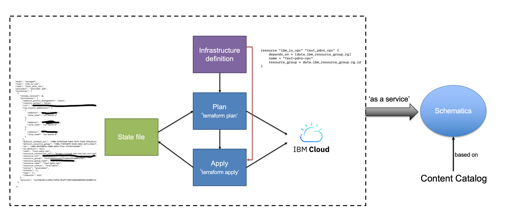
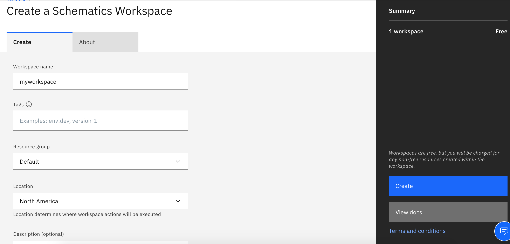

# Example to illustrate how nodejs application can access Mongo DB using Private DNS

The intend of this article is to walk through the processes that are involved in setting up a simple client and the server virtual server instance (VSI) in the IBM Cloud VPC with Private DNS (P-DNS) using Schematics (Terraform as a Service from IBM Cloud). 

The example below illustrates how a nodejs application can access Mongo DB using Private DNS in a VPC in IBM Cloud.


The team members who worked on this example:

Sakthi Saravanan Shanmugam (sakshan1@in.ibm.com), IBM Cloud Network  
Malarvizhi Kandasamy (k.malarvizhi@in.ibm.com), IBM Cloud Network     


> What you'll learn

The reader will get to know the steps to the provision below IBM Cloud services using Terraform:

- Virtual Private Cloud
- Subnet
- Two VSI's (one would act as a MongoDB server, and other as a NodeJS based client)
- Required security group rules
- Private DNS instance with required DNS records

> Prerequisite:

- IBM Cloud account

> Setup and Requirements

While running through this exercise, the user would end up creating a Terraform codebase that would help us provisioning required IBM Cloud services that are intended. The later part of this exercise would explain the process relates to executing the Terraform code using Schematics. Also, we have provided the steps to install Mongo db in server VSI and nodejs in client VSI. We will show you how a nodejs application can connect to mongodb using private domain name service.  

### Assumption:

You should have the GitHub repo created that would contain the below-mentioned code snippets. 

** Create a file named "main.tf" and start adding following contents into that **

#### Initialize the terraform provider plugin:

Terraform is the de facto industry automation tool for provisioning and managing the resources in the Cloud environment. It supports multiple cloud providers, hence explicit plugin initialization is required to point to specific cloud infrastructure. For e.g. IBM Cloud.

*Add the below lines into the `main.tf` file:*

```
provider "ibm" {
  generation = 2
  region     = "us-south"
}
```
#### Provision a VPC:

A VPC is a public cloud offering that lets an enterprise establish its own private cloud-like computing environment on shared public cloud infrastructure. A VPC gives an enterprise the ability to define and control a virtual network that is logically isolated from all other public cloud tenants, creating a private, secure place on the public cloud.

*To provision a VPC, add below code snippets into the `main.tf` file.*

***Note:*** Resource Group is assumed to be `Default` in this exercise if needed change it as per the requirement.

```
data "ibm_resource_group" "rg" {
  name = "Default"
}

resource "ibm_is_vpc" "test_schematics_demo_vpc" {
  depends_on     = [data.ibm_resource_group.rg]
  name           = "test-schematics-demo-vpc"
  resource_group = data.ibm_resource_group.rg.id
}
```
#### Provision a Subnet: 

A VPC is divided into subnets, using a range of private IP addresses. Subnets are contained within a single zone and cannot span multiple zones, which helps improve security, reduce latency, and enable high availability.

*To provision a Subnet, add below code snippets into the `main.tf` file.*

```
resource "ibm_is_subnet" "test_schematics_demo_subnet" {
  name            = "test-schematics-demo-subnet"
  vpc             = ibm_is_vpc.test_schematics_demo_vpc.id
  zone            = "us-south-1"
  ipv4_cidr_block = "10.240.0.0/24"
}
```
#### Provision Security Group and Rules:

Security Group is a set of IP filter rules that define how to handle incoming (ingress) and outgoing (egress) traffic to both the public and private interfaces of a virtual server instance. The rules that you add to a security group are known as security group rules.

***Note:*** By default, there will be no traffic allowed in and out of VSI. Explicitly add rules based on the requirements. In this exercise, we would allow all traffic in & out.

*To add a Security Group, add below code snippets into the `main.tf` file.*

```
resource "ibm_is_security_group" "test_schematics_demo_sg" {
  name           = "test-schematics-demo-sg"
  vpc            = ibm_is_vpc.test_schematics_demo_vpc.id
  resource_group = data.ibm_resource_group.rg.id
}
```

*To add a Security Rules into the group that got created above, add below code snippets into the `main.tf` file.*

```
resource "ibm_is_security_group_rule" "test_schematics_demo_sg_rule_all_in" {
  depends_on = [ibm_is_security_group_rule.test_schematics_demo_sg_rule_ssh]
  group      = ibm_is_security_group.test_schematics_demo_sg.id
  direction  = "inbound"
  remote     = "0.0.0.0/0"
}

resource "ibm_is_security_group_rule" "test_schematics_demo_sg_rule_all_out" {
  depends_on = [ibm_is_security_group_rule.test_schematics_demo_sg_rule_all_in]
  group      = ibm_is_security_group.test_schematics_demo_sg.id
  direction  = "outbound"
  remote     = "0.0.0.0/0"
}
```

#### Provision Virtual Server Instances:

With Virtual Servers for VPC, you can create an instance that consists of your virtual compute resources and resulting capacity within an IBM Cloud VPC. When you provision an instance, you select an instance profile that matches the amount of memory and compute power that you need for the application or software that you plan to run on the instance.

***Note:*** In this exercise, we would be spinning up two VSIs that are based on Ubuntu 18.04, this image is already available in the IBM Cloud, so we just need to fetch the image information to input to the instance block. 

*To fetch Ubuntu 18.04 image information, add below code snippets into the `main.tf` file.*

```
data "ibm_is_image" "test_schematics_demo_image" {
  name = "ibm-ubuntu-18-04-1-minimal-amd64-2"
}
```
***Note:*** Before spinning up the VSI, we would need to add SSH keys into the IBM Cloud to access the VSI instance. The assumption here is that already this process is taken care of. To fetch the ssh key that needs to be added to the VSI, add the following piece of code into the `main.tf`file.

```
data "ibm_is_ssh_key" "test_schematics_demo_ssh_key" {
  name = "user-ssh"
}
```
###### Spin up the server VSI using the below code, add it into the `main.tf` file.

```
resource "ibm_is_instance" "test_schematics_demo_vsi_server" {
  depends_on = [ibm_is_security_group_rule.test_schematics_demo_sg_rule_all_out]
  name           = "test-schematics-demo-vsi-server"
  image          = data.ibm_is_image.test_schematics_demo_image.id
  profile        = "bx2-16x64"
  resource_group = data.ibm_resource_group.rg.id

  primary_network_interface {
    subnet          = ibm_is_subnet.test_schematics_demo_subnet.id
    security_groups = [ibm_is_security_group.test_schematics_demo_sg.id]
  }

  vpc  = ibm_is_vpc.test_schematics_demo_vpc.id
  zone = "us-south-1"
  keys = ["${data.ibm_is_ssh_key.test_schematics_demo_ssh_key.id}"]

  timeouts {
    create = "10m"
    delete = "10m"
  }
}
```

###### Spin up the client VSI using the below code, add it into the `main.tf` file.

```
resource "ibm_is_instance" "test_schematics_demo_vsi_client" {
  depends_on = [ibm_is_security_group_rule.test_schematics_demo_sg_rule_all_out]
  name           = "test-schematics-demo-vsi-client"
  image          = data.ibm_is_image.test_schematics_demo_image.id
  profile        = "bx2-16x64"
  resource_group = data.ibm_resource_group.rg.id

  primary_network_interface {
    subnet          = ibm_is_subnet.test_schematics_demo_subnet.id
    security_groups = [ibm_is_security_group.test_schematics_demo_sg.id]
  }

  vpc  = ibm_is_vpc.test_schematics_demo_vpc.id
  zone = "us-south-1"
  keys = ["${data.ibm_is_ssh_key.test_schematics_demo_ssh_key.id}"]

  timeouts {
    create = "10m"
    delete = "10m"
  }
}

```
#### Provision a Private DNS Instance:

Computers on a network can find one another by IP addresses. To make it easier to work within a computer network, people can use a Domain Name System (DNS) to associate human-friendly domain names with IP addresses, similar to a phonebook. A DNS can also associate other information beyond just computer network addresses to domain names. IBM Cloud™ DNS Services provides private DNS to Virtual Private Cloud (VPC) users. Private DNS zones are resolvable only on IBM Cloud, and only from explicitly permitted networks (VPC) in an account.

*To provision a P-DNS instance, add below code snippets into the `main.tf` file.*

```
resource "ibm_resource_instance" "test_schematics_demo_pdns" {
  depends_on        = [ibm_is_vpc.test_schematics_demo_vpc]
  name              = "test-schematics-demo-pdns"
  resource_group_id = data.ibm_resource_group.rg.id
  location          = "global"
  service           = "dns-svcs"
  plan              = "standard-dns"
}
```

*To create a P-DNS zone and define domain to the zone, add below code snippets into the `main.tf` file.*

```
resource "ibm_dns_zone" "test_schematics_demo_pdns_zone" {
  depends_on  = [ibm_resource_instance.test_schematics_demo_pdns]
  name        = "test.com"
  instance_id = ibm_resource_instance.test_schematics_demo_pdns.guid
  description = "testdescription"
  label       = "testlabel"
}
```

*To associate permitted network to the Private DNS zone, add below code snippets into the `main.tf` file.*
```
resource "ibm_dns_permitted_network" "test_schematics_demo_pdns_permitted_network" {
  depends_on  = [ibm_dns_zone.test_schematics_demo_pdns_zone]
  instance_id = ibm_resource_instance.test_schematics_demo_pdns.guid
  zone_id     = ibm_dns_zone.test_schematics_demo_pdns_zone.zone_id
  vpc_crn     = ibm_is_vpc.test_schematics_demo_vpc.resource_crn
}
```

###### For this exercise, we would be creating a simple 'A' record that would point to server VSI, so that client can access the server using this DNS address.

*Add below code snippets into the `main.tf` file.*

```
resource "ibm_dns_resource_record" "test_schematics_demo_pdns_record_a" {
  depends_on  = [ibm_dns_permitted_network.test_schematics_demo_pdns_permitted_network, ibm_is_instance.test_schematics_demo_vsi_server]
  instance_id = ibm_resource_instance.test_schematics_demo_pdns.guid
  zone_id     = ibm_dns_zone.test_schematics_demo_pdns_zone.zone_id
  type        = "A"
  name        = "testA"
  rdata       = ibm_is_instance.test_schematics_demo_vsi_server.primary_network_interface[0].primary_ipv4_address
  ttl         = 900
}
```

#### Configure DNS server in the VSI:

The VSIs on the VPC must be configured to use the private DNS resolvers 161.26.0.7 and 161.26.0.8. For example, on some Linux distributions, this is done by editing the file /etc/resolv.conf. It may also be possible to override the default DNS resolvers using cloud-init during server boot up. Consult your operating system manuals for more information.

***Note:*** In this exercise, we will be doing this configuration once (or after) the successful provisioning of VSI.

#### Reserve and Associate Floating IP to the Client VSI to access from your machine:

*Add below code snippets into the `main.tf` file.*

```
resource "ibm_is_floating_ip" "test_schematics_demo_fip" {
  name   = "test-schematics-demo-fip"
  target = ibm_is_instance.test_schematics_demo_vsi_client.primary_network_interface.0.id
}
```

###### Output the required values, in case anything needed, Terraform would print those at the end after successful execution.

```
output "server_private_ip" {
  value       = ibm_is_instance.test_schematics_demo_vsi_server.primary_network_interface[0].primary_ipv4_address
  description = "The private IP of the server."
}

output "client_private_ip" {
  value       = ibm_is_instance.test_schematics_demo_vsi_client.primary_network_interface[0].primary_ipv4_address
  description = "The private IP of the client."
}

output "client_floating_ip" {
  value       = ibm_is_floating_ip.test_schematics_demo_fip.address
  description = "The floating IP of the client."
}
```
***Now, the code would look something like the below link.***

https://github.com/IBM-Cloud/vnf-samples/tree/master/pdns-mongo-nodejs/main.tf

> Schematics Overview:

IBM Cloud Schematics delivers Terraform-as-a-Service so that you can use a high-level scripting language to model the resources that you want in your IBM Cloud environment, and enable Infrastructure as Code (IaC). The below picture explains the workflow of the Terraform and Schematics. 



***To execute the Terraform code*** that we have written so far, we can leverage the Schematics tool from IBM. That lessens the task of managing Terraform versions, state files, user management, etc,. To do that login to the IBM Cloud and select Schematics from the left pane.


***Create a Schematics workspace*** by selecting the Location, and by clicking the Create workspace button.

This workspace is an isolated environment where state files, in fact, complete execution lifecycle of Terraform is separated from other workspaces. 


***Fill the name and resource group*** for the Schematics workspace that is going to be created, then click Create.



***Import the terraform template*** (link to the repo in which we have pushed the code) and select the terraform version required.


On successful import, the page will get redirected to the workspace settings page, in this exercise, there are no input variables declared, hence it will say "Workspace Variables: There are no variables defined for the workspace."


Now we are ready with workspace in which we can start executing Terraform code. To do that, we can use the `Generate plan` and `Apply plan`. (that are equivalent to `terraform plan` and the `terraform apply` command.

***Note:*** `terraform plan` command will not create any resources in the cloud infrastructure. It is just the dry run to get the report on what changes the `apply` command will make. This report would be generated with the help of comparing state file information with current infrastructure on the cloud.

We can view the status of the `plan` or the `apply` operation in the `Activity` page, if needed we can choose the see the detailed logs from the Terraform console for each operation by clicking `View log` link against the operation status.


#### Configure the Private DNS:

- Use the floating IP associated with the client VSI to get into the console and configure the DNS server in the `/etc/resolv.conf` file by adding the below lines:

```
nameserver 161.26.0.7 
nameserver 161.26.0.8
```
***To verify the DNS names are resolved using Private DNS***, we can use the `dig` command. Run:

It should resolve to the private IP address of the server VSI.
```
dig testa.test.com
```

#### Clean up the workspace:

In case if you want to delete the workspace or the resources that got created, choose the `Delete` option from the `Action` drop button.


Select appropriate checkbox and then click `Delete`.


