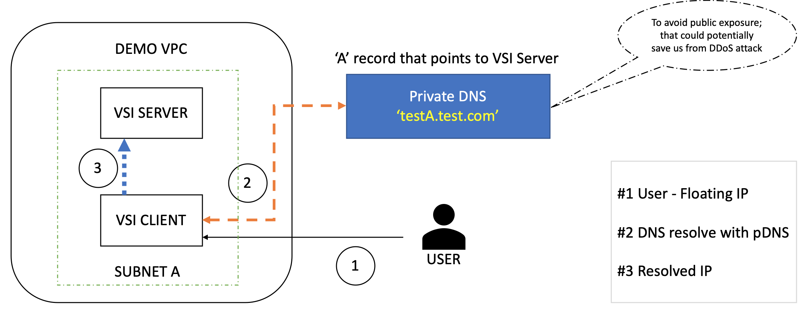

### Example to illustrate how a VSI can use Block Storage as data volume to store mongo db data.   

The intent of this article is to walk you through the process that are involved in setting up a virtual server instance (VSI) with block storage as data volume to store mongo db data in the IBM Cloud VPC.

After the setup, you can configure private dns in the server VSI and connect to mongo db from a client VSI that is running nodejs application. The client and server will communicate using Private DNS (p-DNS).

The example below illustrates how a Virtual Server Instance in IBM Cloud VPC can use Block Storage as data volume to store mongo db data.  

The reader will get to know the steps to the provision below IBM Cloud services using Terraform:

- Virtual Private Cloud. 
- Subnet. 
- Two VSI's (one would act as a MongoDB server, and other as a NodeJS based client). 
- Required security group rules. 
- Private DNS instance with required DNS records (testb.testpdns.com). 

Manual Steps: 

- Install Docker and mongodb as docker container.   
- Run Mongodb container and use the volume as Block storage volume. 
- Connect to Mongodb using mongo client and test whether setup works.    

> Prerequisite:

- IBM Cloud account. 

**References:**

Installing Docker in ubuntu
https://www.digitalocean.com/community/tutorials/how-to-install-and-use-docker-on-ubuntu-16-04

How to Deploy and Manage MongoDB with Docker
https://phoenixnap.com/kb/docker-mongodb

Using your block storage data volume (CLI)
https://cloud.ibm.com/docs/vpc?topic=vpc-start-using-your-block-storage-data-volume

Steps to format and mount block storage volume 
https://github.com/hkantare/terraform-vpc-db/blob/master/playbooks/mount.yml

